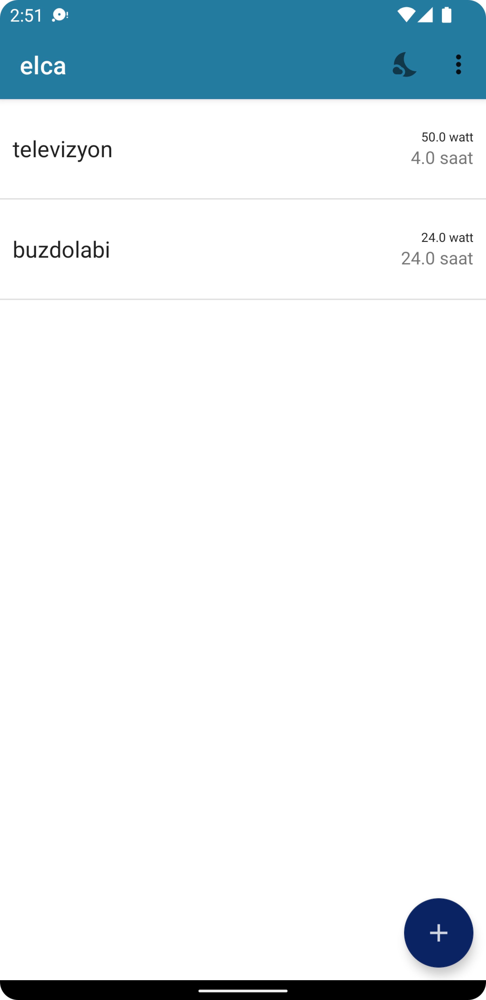
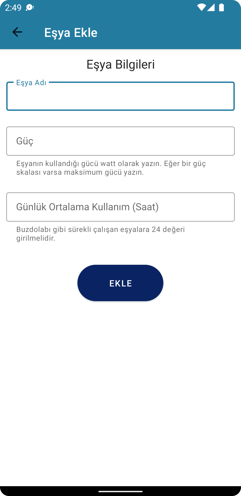
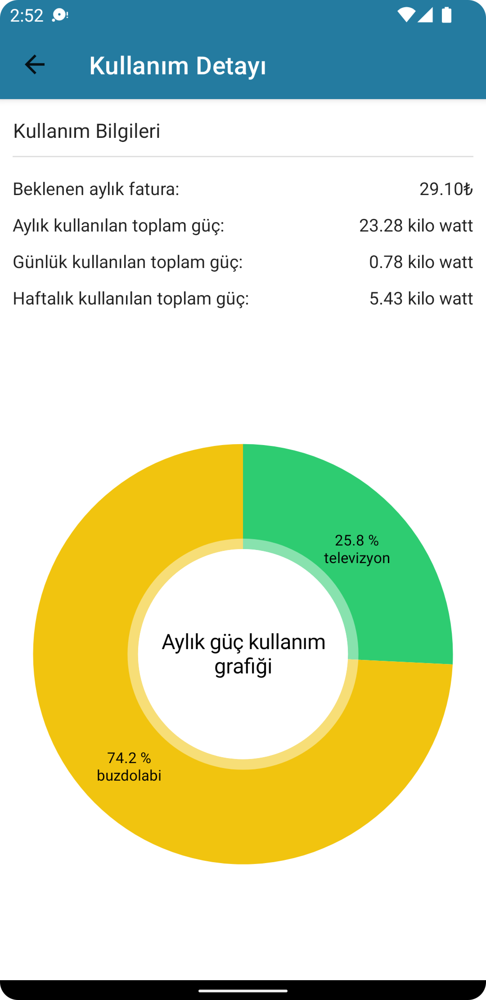
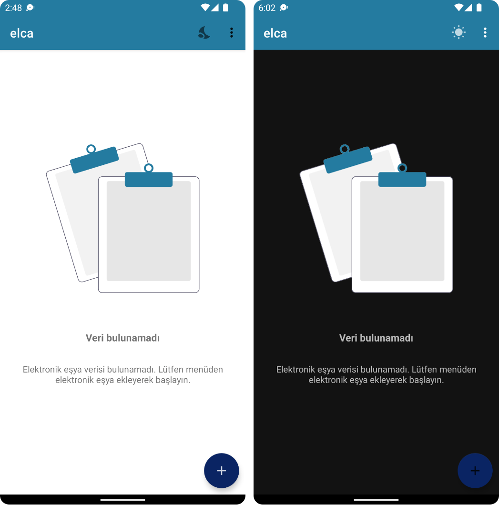
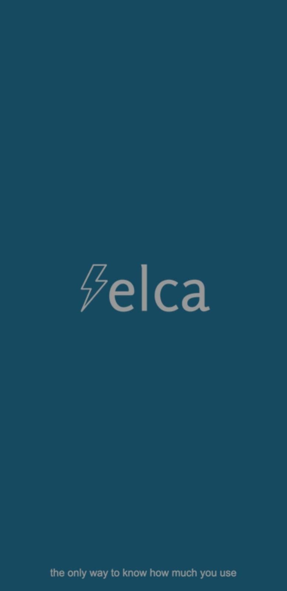

# Elca

Elca is an android app written with java that calculates monthly costs and power usage of electronic stuffs. Elca created for Turkey's electricity price policity but since it is open source anyone can change the calculation algorithm according to their country or state. 

## Screenshots

  
  
  

## Features

### Design Principles

In generally, Material design elements used wherever possible. For example: SnackBar, TextInputLayout, ToolBar. And also, AppCompat components used in generally for [backwards compatibility.](https://developer.android.com/training/backward-compatible-ui)

### Dark Theme support

Elca supports dark and light theme. With icon in toolbar, we can switch between themes. Users choices is remembering with SharedPreferences logic.

  

### Splash Screen

There is no package used for Splash Screen because the packages for Splash Screen downgrades min sdk version in the application. I've created an Activity, layout and theme for Splash Screen as mentioned in [Atul Sharma's article.](https://medium.com/geekculture/implementing-the-perfect-splash-screen-in-android-295de045a8dc)

  
See Splash Screen

  

    
  

### Usage Data Visualization Pie Char

For visualization of monthly power usage, I've used [MPAndroidChart.](https://github.com/PhilJay/MPAndroidChart/)

